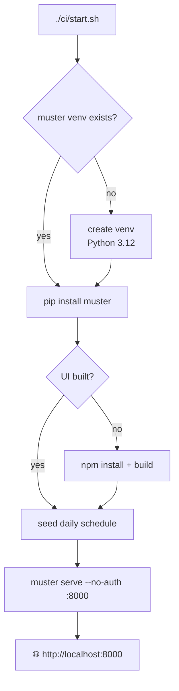
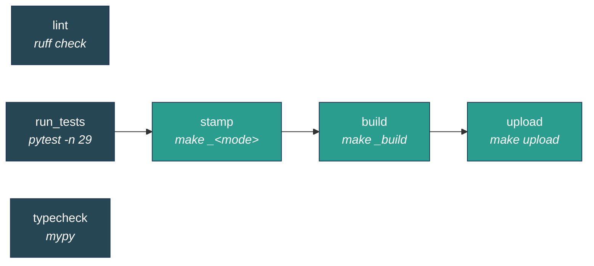

# vmn Local CI

A daily test pipeline powered by [Muster](https://github.com/progovoy/multi_target_debugger),
viewable in a web dashboard.

## Quick start

```bash
./ci/start.sh
```

Open **http://localhost:8000** — no password needed.
Click **Trigger** to see the pipeline DAG and launch a run manually.

This creates a Python venv, installs muster from `../multi_target_debugger`,
seeds a daily schedule, and starts the Muster pipeline server.



## Run tests now

Instead of waiting for the 2am daily run:

```bash
# Option A: start server + trigger immediately
./ci/start.sh --run-now

# Option B: run without the server (CLI only)
.mtd/muster_venv/bin/muster run ci/pipeline.py --cache-dir .mtd/cache
```

## The pipeline



| Stage | What it does | Cached? |
|-------|-------------|---------|
| `lint` | Runs `ruff check` on `version_stamp/` | No |
| `run_tests` | Runs `pytest tests/ -n 29` (parallel, 29 workers), produces JUnit XML + HTML report | No |
| `typecheck` | Runs `mypy` on `version_stamp/` | No |
| `stamp` | **Optional.** `make _<mode>` (`vmn stamp`) when `--param stamp=<mode>` is set | No |
| `build` | **Optional.** `make _build` (wheel) when `--param build=1` is set | No |
| `upload` | **Optional.** `make upload` (twine) when `--param upload=1` is set | No |

## Release lane (optional stages)

`stamp`, `build`, and `upload` are **opt-in**: each records a `skipped` status
(via `ctx.skip`, not a fake `succeeded`) unless its run param is set, so the
daily/manual test run stays test-only and reads honestly in the UI. When set,
they reuse the repo's `Makefile` targets and run after `run_tests` (the DAG is
`run_tests → stamp → build → upload`), so a release never ships on a crashed
test run. A skipped stage still satisfies its dependents, so the chain proceeds.
Being side-effecting, they are never cached.

The three params are independent — pass only the steps you want:

```bash
MUSTER=.mtd/muster_venv/bin/muster

# Stamp a patch, build the wheel, and upload — the full release:
$MUSTER run ci/pipeline.py --cache-dir .mtd/cache \
    --param stamp=patch --param build=1 --param upload=1

# Just stamp a minor version (no build/upload):
$MUSTER run ci/pipeline.py --cache-dir .mtd/cache --param stamp=minor

# Just build a wheel to test packaging (no stamp, no upload):
$MUSTER run ci/pipeline.py --cache-dir .mtd/cache --param build=1
```

| Param | Accepted values | Maps to |
|-------|-----------------|---------|
| `stamp` | `major` / `minor` / `patch` / `rc` | `make _major` / `_minor` / `_patch` / `_rc` |
| `build` | `1` / `true` / `yes` / `on` | `make _build` |
| `upload` | `1` / `true` / `yes` / `on` | `make upload` |

An unknown `stamp` value fails the stage rather than silently skipping. `build`
needs `npm` (UI build) and `upload` needs `twine` on `PATH` — `ctx.run` keeps
the system `PATH`, so tools installed outside the venv still resolve. When
`stamp=rc` and `build` are combined, `build` passes the prerelease template
through to `make _build` (the Makefile's `rc:` target relies on that surviving
within one make process, which separate stages don't), so the wheel embeds
`0.10.2-rc.N` rather than `0.10.2`.

You can also set these on a schedule via its `params` object, e.g. a weekly
release schedule with `{"stamp": "patch", "build": "1", "upload": "1"}`.

The pipeline sets `workspace=".."`, so muster anchors every run to the repo
root (this file lives in `ci/`, and muster resolves a relative pipeline
workspace against the pipeline file). That means a run tests the checked-out
repo in place whether it's launched from the CLI, the UI **Trigger** button, or
the daily schedule — muster doesn't drop it in an empty per-run scratch dir.

The three stages have no dependencies, so they run in parallel. Every stage
declares `requires` (`tests/requirements.txt` + `tests/test_requirements.txt` +
vmn installed editable). muster builds that venv once, content-addressed by the
requirements files' contents under `.mtd/envs/`, and all three stages run inside
it — no hand-rolled venv or `pip install`. Because the workspace is the repo,
that venv persists across runs and rebuilds only when a requirements file
changes; muster's build lock serializes the concurrent builders, so the first
stage to need it builds it and the others reuse it.

Each stage runs its tool through `ctx.run` (bare names resolve via the venv's
`bin` on `PATH`), which captures the tool output into a per-stage **card** shown
in the run UI. `run_tests` additionally writes `reports/tests.xml` (JUnit) and
`reports/tests.html` as downloadable artifacts.

Lint and typecheck are report-only — they don't fail the pipeline on warnings.
`run_tests` only fails on pytest crashes (exit code > 1), not on test failures
(exit code 1), so you always get the full report.

## Useful commands

All commands use the muster CLI from the dedicated venv:

```bash
MUSTER=.mtd/muster_venv/bin/muster

# See the stage graph
$MUSTER inspect ci/pipeline.py

# List all runs
$MUSTER status

# See details of a specific run
$MUSTER status <run_id>

# Resume a failed run from where it stopped
$MUSTER resume ci/pipeline.py <run_id> --cache-dir .mtd/cache

# Re-run just one stage
$MUSTER rerun ci/pipeline.py <run_id> --stage run_tests --cache-dir .mtd/cache
```

## Schedule

Runs daily at 02:00 local time. The schedule is defined in
`.mtd/schedules/s-vmn-daily.json`:

```json
{
  "id": "s-vmn-daily",
  "name": "vmn nightly tests",
  "cron": "0 2 * * *",
  "pipeline_file": "ci/pipeline.py",
  "cache_dir": ".mtd/cache",
  "enabled": true
}
```

Edit the cron expression to change the schedule, or set `"enabled": false` to
pause it. You can also edit schedules through the web UI.

## File layout

| Path | Purpose |
|------|---------|
| `ci/pipeline.py` | Pipeline definition (stages, DAG) |
| `ci/start.sh` | Bootstrap + launch script |
| `.mtd/envs/` | muster-built venvs for running tests, keyed by requirements contents |
| `.mtd/muster_venv/` | Dedicated venv for muster itself |
| `.mtd/runs/` | Run history (state.json, cards, console logs) |
| `.mtd/cache/` | Content-addressed stage cache |
| `.mtd/schedules/` | Schedule configs (JSON) |
| `.mtd/workspaces/` | Per-run scratch dirs (stage outputs) |

Everything under `.mtd/` is gitignored. Delete it to start completely fresh.

## Prerequisites

- Python 3.12 (`/opt/homebrew/bin/python3.12`)
- Node.js (for building the muster web UI from source — `brew install node`)
- `../multi_target_debugger` checked out next to this repo
- Docker (optional, only for the backward-compat tests)

## Environment variables

The start script sets these automatically. Override them to customize:

| Variable | Default | Purpose |
|----------|---------|---------|
| `MTD_PIPELINES_DIR` | repo root | Where the trigger page looks for pipeline `.py` files |
| `MTD_PIPELINE_STATE_DIR` | `.mtd/runs` | Run history directory |
| `MTD_PIPELINE_WORKSPACES_DIR` | `.mtd/workspaces` | Per-run scratch dirs for stage outputs |

## Troubleshooting

**"No pipelines available" on the trigger page**

The `MTD_PIPELINES_DIR` env var must point to the directory containing your
pipeline files. The start script sets this to the repo root. If you run
`muster serve` manually, export it first:
`export MTD_PIPELINES_DIR="$(pwd)"`

**"port 8000 is already in use"**

Kill the old process: `kill $(lsof -ti :8000)`

**"The web UI is not built"**

Build it from source:
```bash
cd ../multi_target_debugger/ui && npm install && npm run build
```

Or add Node to your PATH and re-run `./ci/start.sh` — the script auto-builds
if `ui/dist/` doesn't exist.

**Tests fail with Docker errors**

The 3 backward-compat tests require Docker. If Docker isn't available or its
network is broken, they skip gracefully. This is expected.

**"venv creation failed"**

Ensure Python 3.12 is at `/opt/homebrew/bin/python3.12`. If it's elsewhere,
edit line 21 of `ci/start.sh`.
