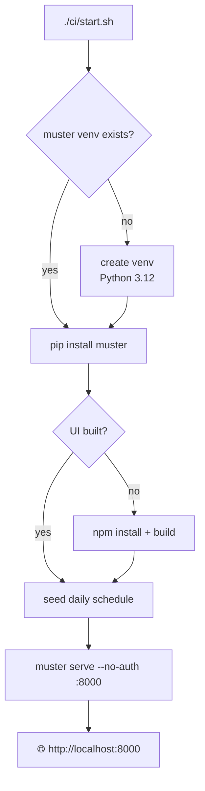
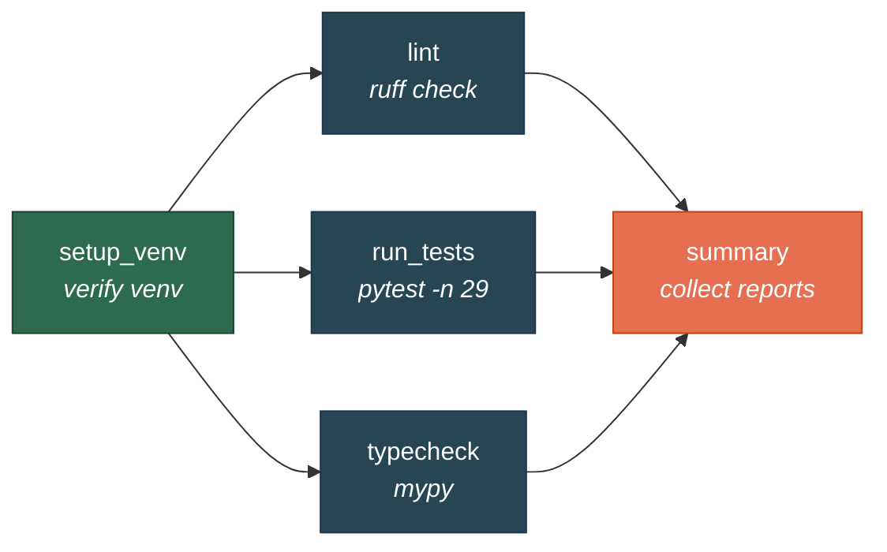

# vmn Local CI

A daily test pipeline powered by [Muster](https://github.com/progovoy/multi_target_debugger),
viewable in a web dashboard.

## Quick start

```bash
./ci/start.sh
```

Open **http://localhost:8000** — no password needed.
Click **Trigger** to see the pipeline DAG and launch a run manually.

This creates a Python venv, installs muster from `../multi_target_debugger`,
seeds a daily schedule, and starts the Muster pipeline server.



## Run tests now

Instead of waiting for the 2am daily run:

```bash
# Option A: start server + trigger immediately
./ci/start.sh --run-now

# Option B: run without the server (CLI only)
.mtd/muster_venv/bin/muster run ci/pipeline.py --cache-dir .mtd/cache
```

## The pipeline



| Stage | What it does | Cached? |
|-------|-------------|---------|
| `setup_venv` | Verifies the muster-built venv (`import version_stamp`) so the DAG blocks here if deps are broken | No |
| `lint` | Runs `ruff check` on `version_stamp/` | No |
| `run_tests` | Runs `pytest tests/ -n 29` (parallel, 29 workers), produces JUnit XML + HTML report | No |
| `typecheck` | Runs `mypy` on `version_stamp/` | No |
| `summary` | Collects lint/tests/typecheck results into one report | No |

Every stage declares `requires` (`tests/requirements.txt` +
`tests/test_requirements.txt` + vmn installed editable). muster builds that venv
once, content-addressed by the requirements files' contents under `.mtd/envs/`,
and all four stages run inside it — no hand-rolled venv or `pip install`. The
venv rebuilds only when a requirements file changes. `setup_venv` runs first
(the others depend on its `reports/venv.txt`) so the one-time build happens once,
not in a three-way race; the three middle stages then run in parallel.

Lint and typecheck are report-only — they don't fail the pipeline on warnings.
`run_tests` only fails on pytest crashes (exit code > 1), not on test failures
(exit code 1), so you always get the full report.

## Useful commands

All commands use the muster CLI from the dedicated venv:

```bash
MUSTER=.mtd/muster_venv/bin/muster

# See the stage graph
$MUSTER inspect ci/pipeline.py

# List all runs
$MUSTER status

# See details of a specific run
$MUSTER status <run_id>

# Resume a failed run from where it stopped
$MUSTER resume ci/pipeline.py <run_id> --cache-dir .mtd/cache

# Re-run just one stage
$MUSTER rerun ci/pipeline.py <run_id> --stage run_tests --cache-dir .mtd/cache
```

## Schedule

Runs daily at 02:00 local time. The schedule is defined in
`.mtd/schedules/s-vmn-daily.json`:

```json
{
  "id": "s-vmn-daily",
  "name": "vmn nightly tests",
  "cron": "0 2 * * *",
  "pipeline_file": "ci/pipeline.py",
  "cache_dir": ".mtd/cache",
  "enabled": true
}
```

Edit the cron expression to change the schedule, or set `"enabled": false` to
pause it. You can also edit schedules through the web UI.

## File layout

| Path | Purpose |
|------|---------|
| `ci/pipeline.py` | Pipeline definition (stages, DAG) |
| `ci/start.sh` | Bootstrap + launch script |
| `.mtd/envs/` | muster-built venvs for running tests, keyed by requirements contents |
| `.mtd/muster_venv/` | Dedicated venv for muster itself |
| `.mtd/runs/` | Run history (state.json, cards, console logs) |
| `.mtd/cache/` | Content-addressed stage cache |
| `.mtd/schedules/` | Schedule configs (JSON) |
| `.mtd/workspaces/` | Per-run scratch dirs (stage outputs) |

Everything under `.mtd/` is gitignored. Delete it to start completely fresh.

## Prerequisites

- Python 3.12 (`/opt/homebrew/bin/python3.12`)
- Node.js (for building the muster web UI from source — `brew install node`)
- `../multi_target_debugger` checked out next to this repo
- Docker (optional, only for the backward-compat tests)

## Environment variables

The start script sets these automatically. Override them to customize:

| Variable | Default | Purpose |
|----------|---------|---------|
| `MTD_PIPELINES_DIR` | repo root | Where the trigger page looks for pipeline `.py` files |
| `MTD_PIPELINE_STATE_DIR` | `.mtd/runs` | Run history directory |
| `MTD_PIPELINE_WORKSPACES_DIR` | `.mtd/workspaces` | Per-run scratch dirs for stage outputs |

## Troubleshooting

**"No pipelines available" on the trigger page**

The `MTD_PIPELINES_DIR` env var must point to the directory containing your
pipeline files. The start script sets this to the repo root. If you run
`muster serve` manually, export it first:
`export MTD_PIPELINES_DIR="$(pwd)"`

**"port 8000 is already in use"**

Kill the old process: `kill $(lsof -ti :8000)`

**"The web UI is not built"**

Build it from source:
```bash
cd ../multi_target_debugger/ui && npm install && npm run build
```

Or add Node to your PATH and re-run `./ci/start.sh` — the script auto-builds
if `ui/dist/` doesn't exist.

**Tests fail with Docker errors**

The 3 backward-compat tests require Docker. If Docker isn't available or its
network is broken, they skip gracefully. This is expected.

**"venv creation failed"**

Ensure Python 3.12 is at `/opt/homebrew/bin/python3.12`. If it's elsewhere,
edit line 21 of `ci/start.sh`.
