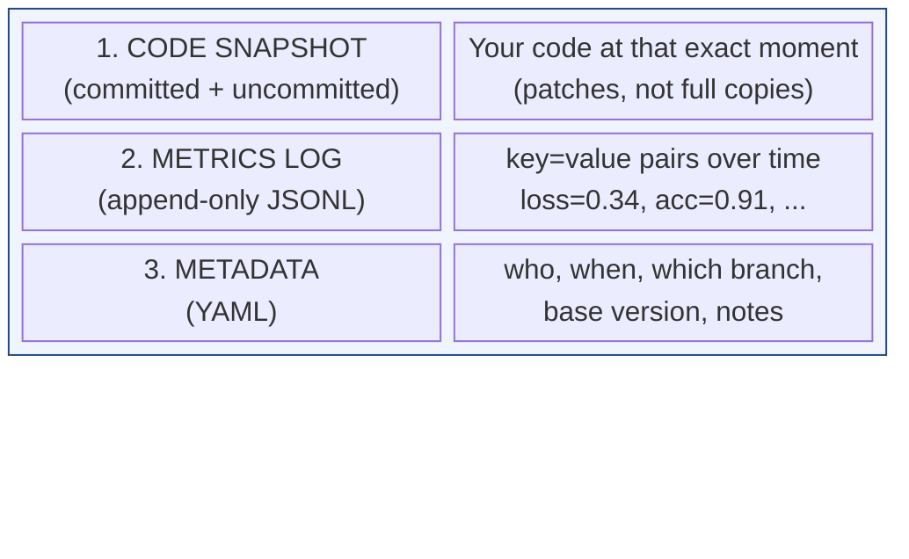
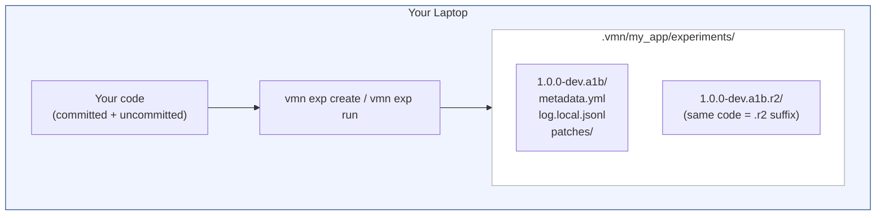
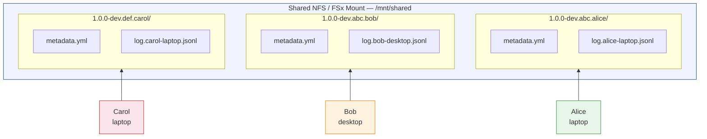
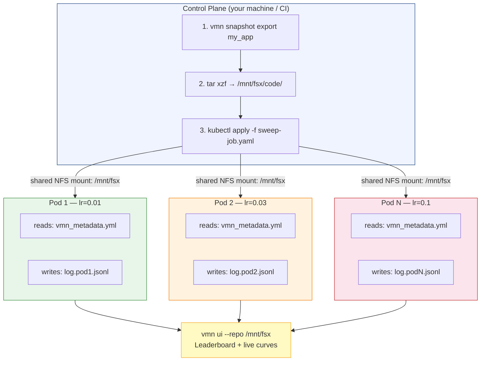
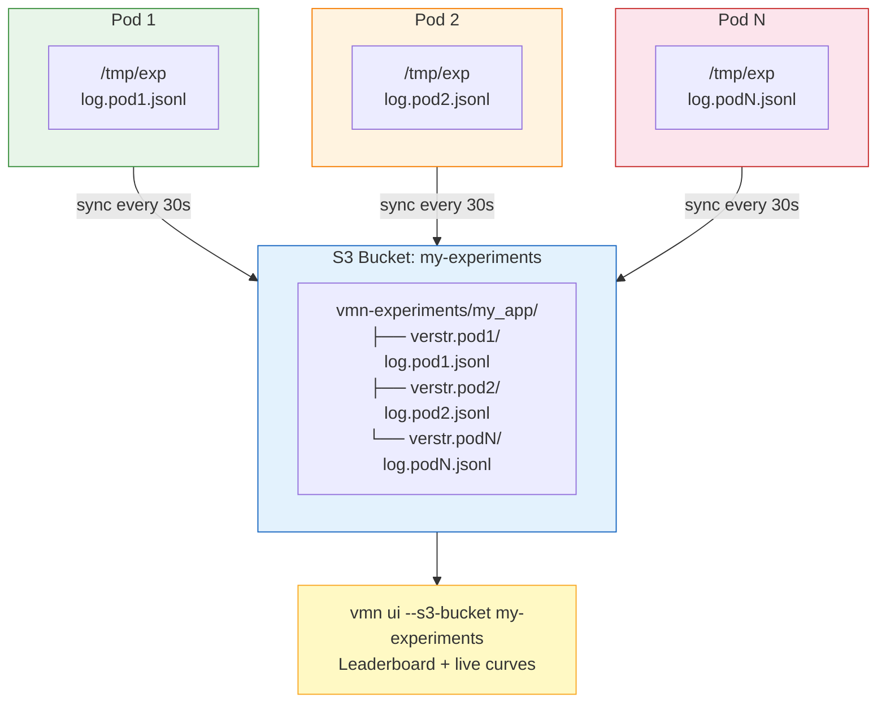
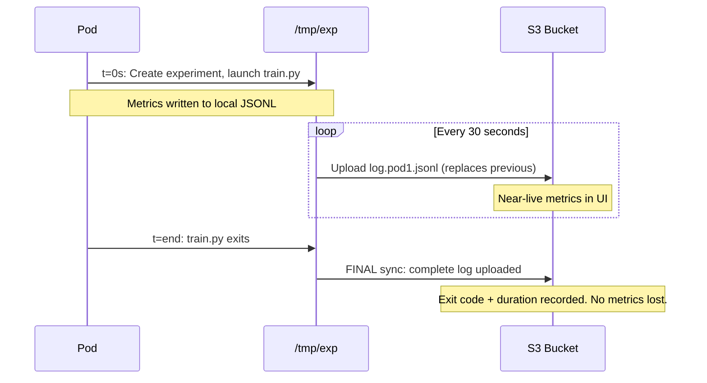
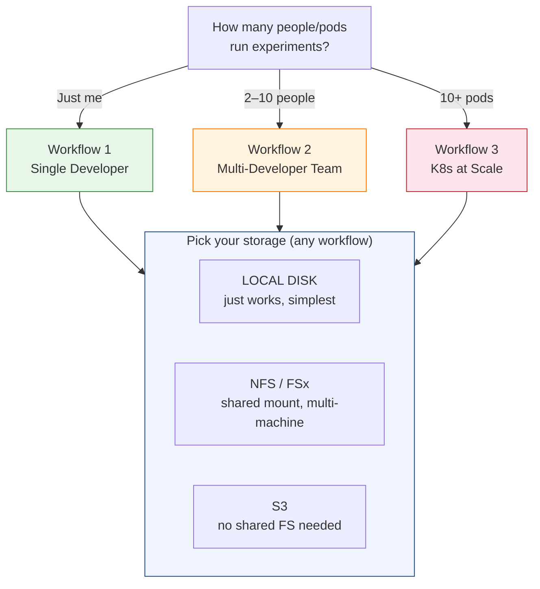

# vmn Experiment Tracking — Workflow Guide for Engineers

**vmn experiments = snapshot of your code + append-only log of metrics.**
No server, no database — just files on disk (or S3).

---

## What Is an Experiment?



> **Stored in:** `.vmn/<app>/experiments/<verstr>/`
> **Format:** plain files — YAML + JSONL — no database

---

## Workflow 1: Single Developer

You're on your laptop. You have a git repo with vmn set up (`vmn stamp -r patch my_app`). You want to try different configs and track what happened.



### Option A: Manual Measurements

Tweak your config, run your test yourself, then record:

```sh
# Experiment 1: try batch=64
vmn exp create my_app --note "batch=64" \
    --metrics latency_ms=12.3 throughput=8100

# Experiment 2: try batch=128
vmn exp create my_app --note "batch=128" \
    --metrics latency_ms=15.1 throughput=9400

# Compare results
vmn exp list my_app --sort latency_ms
vmn exp diff my_app    # code diff + metric delta
```

Each experiment snapshots your entire working tree (committed + uncommitted). If the code hasn't changed between runs, vmn appends `.r2`, `.r3`, etc. Nothing is overwritten.

### Option B: Let vmn Run Your Command

```sh
vmn exp run my_app --note "lr=0.01" -- python train.py --lr 0.01
```

What happens step by step:

1. Snapshots your working tree (committed + uncommitted)
2. Launches your command, streams output to your terminal
3. Sets `$VMN_METRICS_FILE` — your script writes key=value lines there
4. vmn tails that file live (metrics appear in the UI in real time)
5. Writes a `run_state.yml` with a heartbeat while the command is alive
6. When command exits, vmn records exit code + duration

### Writing Metrics From Your Script

```python
import os

metrics_file = os.environ["VMN_METRICS_FILE"]

def log_metric(key, value, step=None):
    with open(metrics_file, "a") as f:
        prefix = f"step={step} " if step is not None else ""
        f.write(f"{prefix}{key}={value}\n")

for epoch in range(100):
    log_metric("loss", loss, step=epoch)    # -> live training curve
log_metric("final_acc", acc)                 # -> scalar metric
```

> `step=N` gives you training curves in the UI. Without `step=`, you get scalar metrics. Works from any language — shell scripts can do: `echo "loss=0.34" >> $VMN_METRICS_FILE`

### Browsing & Comparing

```sh
vmn exp list my_app              # table of all experiments
vmn exp list my_app --sort loss  # sorted by a metric
vmn exp show my_app --latest     # full detail of most recent
vmn exp diff my_app              # code diff + metric delta
vmn exp restore my_app --latest  # checkout that code state
vmn ui                           # web dashboard with charts
```

---

## Workflow 2: Multi-Developer Team

Your team shares a repo. Multiple people run experiments at the same time. Everyone wants to see all results in one place.

> **Key idea:** shared NFS mount + per-writer log files = safe concurrent writes



> Each person writes their **own** log file (no conflicts). When reading, vmn merges **all** `log.*.jsonl` files automatically.

### Setup: One-Time

Mount a shared filesystem that all team members can access. NFS, AWS FSx, GlusterFS, or any POSIX-compatible shared mount works.

Then configure vmn once so nobody has to pass flags every run:

```sh
vmn config my_app    # opens interactive editor
```

Set the experiment storage section in `conf.yml`:

```yaml
# .vmn/my_app/conf.yml
experiment:
  storage:
    experiment_dir: /mnt/shared       # shared mount path
    # writer_id defaults to hostname — usually correct
    # writer_id: alice-laptop         # override if needed
```

> `writer_id` defaults to `hostname` automatically — no config needed in most cases.
> A configured `writer_id` behaves exactly like `--writer-id` (it is exported as
> `VMN_WRITER_ID`); an explicit `--writer-id` or `$VMN_WRITER_ID` still wins.

### Each Developer's Workflow

```sh
# That's it — experiment_dir comes from config, writer_id from hostname
vmn exp run my_app \
    --note "lr=0.01, batch=64" \
    -- python train.py --lr 0.01

# Or with manual metrics
vmn exp create my_app \
    --metrics loss=0.34 acc=0.91 --note "new optimizer"

# CLI flags still work as overrides:
vmn exp run my_app --experiment-dir /other/mount -- python train.py
```

### Why This Is Safe for Concurrent Writes

1. **Writer ID** — each person gets a unique writer ID. Their metrics go to their own file: `log.alice-laptop.jsonl`. No file collisions.
2. **Unique verstr** — each experiment verstr includes the writer ID as suffix: `1.0.0-dev.abc.alice-laptop`. No version collisions.
3. **Atomic writes** — JSONL files use `O_APPEND`, which is atomic on POSIX for lines under 4KB. No locking needed.

### Viewing All Team Results

```sh
# Anyone on the team can see all experiments:
vmn exp list my_app --experiment-dir /mnt/shared
vmn exp diff my_app --experiment-dir /mnt/shared

# Or launch the web UI for a dashboard + charts:
vmn ui --repo /mnt/shared
```

> vmn merges all `log.*.jsonl` files sorted by timestamp — one unified leaderboard.

---

## Workflow 3: K8s at Scale

You're running a hyperparameter sweep: 100–1000 pods, each with a different config. No pod has git installed — they're running from an exported snapshot. Two sub-modes: shared NFS mount (simpler) or S3 (no shared filesystem needed).

### Mode A: K8s + Shared NFS / FSx

> Recommended when you already have a shared filesystem (EFS, FSx, NFS).



> Each pod: **no git**, **no locks**, **no coordination**.

#### Step 1: Export a Snapshot (Control Plane)

```sh
# On your machine (has git)
vmn snapshot export my_app --latest -o /mnt/fsx/snapshot.tar.gz
tar xzf /mnt/fsx/snapshot.tar.gz -C /mnt/fsx/code/

# /mnt/fsx/code/ now contains:
#   vmn_metadata.yml   <- vmn reads this instead of git
#   your_code/         <- the actual source tree
```

#### Step 2: Configure Once (in conf.yml or per-pod flags)

If your snapshot includes `.vmn/my_app/conf.yml`, set it there:

```yaml
experiment:
  storage:
    experiment_dir: /mnt/fsx          # all pods write here
    # writer_id: defaults to hostname (= pod name in K8s)
```

Then each pod's entrypoint is just:

```sh
vmn exp run my_app \
    --from-snapshot /mnt/fsx/code/vmn_metadata.yml \
    -- python train.py --lr $LR --batch $BATCH
```

Or pass flags explicitly (overrides config):

```sh
vmn exp run my_app \
    --from-snapshot /mnt/fsx/code/vmn_metadata.yml \
    --experiment-dir /mnt/fsx \
    --writer-id $HOSTNAME \
    -- python train.py --lr $LR --batch $BATCH
```

#### What Each Flag / Config Does

| Flag / Config | What it does |
|------|-------------|
| `--from-snapshot` | Reads `vmn_metadata.yml` instead of git. No git needed. |
| `--experiment-dir` / `experiment_dir` | Write to shared mount instead of local `.vmn/` |
| `--writer-id` / `writer_id` | Unique pod ID. Defaults to hostname. Metrics go to `log.<id>.jsonl` |

The experiment verstr includes the pod ID: `1.0.0-dev.abc.def.pod-xyz-123`. Zero collision, zero contention, zero coordination between pods.

#### Step 3: View Results

```sh
# From your machine or a dashboard server:
vmn ui --repo /mnt/fsx

# CLI quick check:
vmn exp list my_app --experiment-dir /mnt/fsx --sort loss --top 10
```

### Mode B: K8s + S3 (No Shared Filesystem)

> Use this when pods don't share a filesystem — each writes locally and syncs to S3.



#### Step 1: Export Snapshot to S3 or Embed in Image

```sh
# Option A: Export to S3
vmn snapshot export my_app --latest -o snapshot.tar.gz
aws s3 cp snapshot.tar.gz s3://my-experiments/snapshots/

# Option B: Bake into Docker image (simpler)
# Dockerfile:
#   COPY snapshot/ /workspace/
#   RUN pip install vmn
```

#### Step 2: Configure Once or Pass Flags

Config approach (in `conf.yml` baked into the snapshot):

```yaml
experiment:
  storage:
    backend: s3
    bucket: my-experiments
    experiment_dir: /tmp/exp
    # writer_id: defaults to hostname (= pod name)
```

Then each pod just runs:

```sh
vmn exp run my_app \
    --from-snapshot /workspace/vmn_metadata.yml \
    --sync-interval 30 \
    -- python train.py --lr $LR
```

Or pass everything as flags:

```sh
vmn exp run my_app \
    --from-snapshot /workspace/vmn_metadata.yml \
    --experiment-dir /tmp/exp \
    --writer-id $HOSTNAME \
    --backend s3 --bucket my-experiments \
    --sync-interval 30 \
    -- python train.py --lr $LR
```

#### How S3 Sync Works



- **Near-live:** Metrics appear in the UI within 30 seconds of being written
- **No data loss:** Final sync happens on exit — nothing is lost even if it crashes mid-interval
- **Any S3:** Uses standard S3 PutObject — works with AWS, MinIO, LocalStack, R2

#### Step 3: View Results

```sh
vmn ui --s3-bucket my-experiments --s3-prefix vmn-experiments

# Same UI as local mode: leaderboard, training curves,
# side-by-side comparison, code diffs
```

---

## Choosing a Workflow

|  | Single Dev | Multi-Dev Team | K8s at Scale |
|--|-----------|--------------|--------------|
| Git needed? | Yes | Yes | No (snapshot) |
| Shared FS? | No | Optional (NFS/FSx) | Optional (NFS or S3) |
| Concurrent? | No | Yes | Yes (1000+ pods) |
| Writer ID? | Optional | Recommended | Required |
| S3 support? | Yes | Yes | Yes |
| Setup | None | Mount or S3 bucket | Snapshot export |



> **Typical combos:** Single dev → local disk (default) · Multi-dev → NFS or S3 · K8s → NFS (recommended) or S3

---

## Run Status: Did My Job Die?

At scale the common failure isn't a crash — it's a pod that goes away. The node
is reclaimed, the OOM killer fires, the spot instance is taken back. Nothing
writes "I failed" anywhere, and a naive tracker shows that run as still running
forever.

vmn solves this with a **heartbeat**. `vmn exp run` writes a `run_state.yml`
alongside `metadata.yml` and keeps refreshing it while the child process lives:

```yaml
state: running          # "running" while alive, "finished" after the child exits
command: [python, train.py]
pid: 12345
host: pod-xyz-123
started_at: 2026-09-21T12:00:00Z
heartbeat: 2026-09-21T12:03:00Z   # refreshed while the child is alive
heartbeat_interval_sec: 30
exit_code: null         # an int once finished
finished_at: null
duration_sec: null
```

Because this file lives next to the metrics, it rides the same storage you
already configured — the shared NFS mount, or the S3 prefix.

```sh
vmn exp run my_app --heartbeat-interval 10 -- python train.py
```

### Status Is Derived, Never Stored

vmn computes status from `run_state.yml` plus the current clock. Nobody has to
mark a dead run as dead:

| Status | Means | Typical cause |
|--------|-------|---------------|
| `created` | experiment exists, no command ever started | made with `vmn exp create` |
| `running` | heartbeat is fresh | healthy |
| `stuck` | says running, heartbeat went stale, no exit code | node lost, OOM-killed, pod evicted |
| `succeeded` | finished, exit code 0 | happy path |
| `failed` | finished, non-zero exit code | your command errored |

The staleness window is `max(3 × heartbeat_interval_sec, 60s)`, so a slow
filesystem or a couple of missed beats never produces a false `stuck`.

> **Honest limitation:** a process that is **hung but alive** keeps
> heartbeating, so it reads as `running`. To catch that, look at
> `last_metric_at` (surfaced in the UI and API): a run that's alive but hasn't
> logged a metric in an hour is alive and not making progress. The heartbeat
> answers "is the process there", not "is the process useful".

### The Triage Workflow

```sh
# 1. What's still supposedly alive?
vmn exp list my_app --experiment-dir /mnt/fsx

# 2. Anything flagged stuck? Get the details.
vmn exp show my_app -v <verstr> --experiment-dir /mnt/fsx
#    -> Status: stuck (no heartbeat for 14m, pid 12345 on pod-xyz-123)

# 3. Reproduce the dead run's exact code state and try again locally
vmn exp restore my_app -v <verstr>
```

In the web UI the same thing is one glance: each run carries a color-coded
status pill, `running` pulses, `stuck` is flagged, and the page auto-refreshes
while anything is unfinished.

---

## Outer & Inner Jobs (Sweeps)

A sweep is naturally two levels: one job that launches trials, and the trials.
vmn reconstructs that shape for free.

`vmn exp run` exports `VMN_EXPERIMENT_ID` to its child. **Any experiment created
while that variable is set records it as its `parent`.** So if your sweep driver
is itself wrapped in `vmn exp run`, every trial it launches lands underneath it:

```sh
#!/usr/bin/env bash
# sweep.sh
for lr in 0.001 0.01 0.1; do
    vmn exp run my_app --note "lr=$lr" -- python train.py --lr "$lr"
done
```

```sh
vmn exp run my_app --note "lr sweep" -- ./sweep.sh
```

When the trials run somewhere that doesn't inherit your environment — a K8s pod,
a Slurm step, a remote worker — pass the parent explicitly instead. Plumb the
driver's verstr through as an env var or arg and use `--parent`:

```sh
vmn exp run my_app --parent "$SWEEP_ID" -- python train.py --lr "$LR"
```

`--parent` accepts the same references as everything else: a full verstr, a
unique prefix, `@N`, or `latest`. It works on `vmn exp create` too.

### Rollup: One Bad Trial Fails the Sweep

Each run has a `kind` — `outer` (has children), `inner` (has a parent), or
`single`. An outer job additionally has a **`tree_status`**: the rollup over
itself and its entire subtree, resolved by precedence

```
failed > stuck > running > created > succeeded
```

So a 200-trial sweep reads `running` until every trial is done, then
`succeeded` only if all of them succeeded. One OOM-killed pod shows up as
`stuck` at the top; one non-zero exit shows up as `failed`. You don't scroll the
list to find out whether the sweep was clean.

`vmn exp list` indents inner runs under their outer run:

```
    VERSION                             STATUS      NOTE
[1] 1.6.0-dev.a1b2c3d.9f8e7d6           failed      lr sweep
[2]   1.6.0-dev.a1b2c3d.9f8e7d6.r2      succeeded   lr=0.001
[3]   1.6.0-dev.a1b2c3d.1122334         succeeded   lr=0.01
[4]   1.6.0-dev.a1b2c3d.5566778         failed      lr=0.1
```

`vmn exp show` prints `Parent:` on a trial and `Children:` on the driver, and
the web UI nests the trials under their sweep row.

---

## Reference: Addressing Experiments

Every command that takes an experiment reference supports these forms:

| Form | Meaning |
|------|---------|
| (omitted) | The latest experiment |
| `--latest` | Most recent, explicitly |
| `@N` | N-th row from `exp list` (1-indexed) |
| unique prefix | e.g. `-v 1.6.0-dev.a1b` (shortest unique match) |
| full verstr | Exact match |

---

## Reference: Environment Variables

### Variables You Set (pod spec / .bashrc)

| Variable | Purpose |
|----------|---------|
| `VMN_WRITER_ID` | Unique writer ID (or use `--writer-id` flag) |
| `VMN_EXPERIMENT_DIR` | Shared mount path (or use `--experiment-dir` flag) |
| `VMN_SNAPSHOT_METADATA` | Path to `vmn_metadata.yml` (or use `--from-snapshot`) |

### Variables Set BY vmn (for your training script)

| Variable | Purpose |
|----------|---------|
| `VMN_EXPERIMENT_ID` | The verstr assigned to this run. Any experiment created while it is set is recorded as an [inner job](#outer--inner-jobs-sweeps) of this one |
| `VMN_APP_NAME` | The app name |
| `VMN_METRICS_FILE` | Path to write key=value metric lines |

---

## Reference: CLI Flags & Config for Multi-User / K8s

All storage flags can also be set in `conf.yml` under `experiment.storage` — CLI flags override config.

| Flag | Config key | Description |
|------|-----------|-------------|
| `--from-snapshot <path>` | — | Path to `vmn_metadata.yml` (skips git) |
| `--experiment-dir <path>` | `experiment_dir` | Write experiments to shared mount or scratch dir |
| `--writer-id <id>` | `writer_id` | Unique writer ID (defaults to hostname) |
| `--sync-interval <sec>` | — | Seconds between S3 metric syncs (default: 30) |
| `--heartbeat-interval <sec>` | — | Seconds between heartbeat refreshes (default: 30) |
| `--parent <ref>` | — | Attach the run as an inner job of another experiment |
| `--backend s3` | `backend` | Use S3 storage backend |
| `--bucket <name>` | `bucket` | S3 bucket name |
| `--endpoint-url <url>` | `endpoint_url` | Custom S3 endpoint (MinIO, LocalStack) |
| `--prefix <prefix>` | `prefix` | Key prefix in bucket (default: `vmn-experiments`) |

Example `conf.yml`:

```yaml
experiment:
  storage:
    experiment_dir: /mnt/shared
    backend: s3               # optional — only for S3 mode
    bucket: my-experiments    # optional — only for S3 mode
```

---

## Quick Start: K8s Pod Spec (NFS)

```yaml
containers:
  - name: experiment
    image: my-training:latest
    command:
      - vmn
      - exp
      - run
      - my_app
      - --from-snapshot
      - /mnt/fsx/code/vmn_metadata.yml
      - --experiment-dir
      - /mnt/fsx
      - --writer-id
      - $(HOSTNAME)
      - --
      - python
      - train.py
    env:
      - name: HOSTNAME
        valueFrom:
          fieldRef:
            fieldPath: metadata.name
    volumeMounts:
      - name: shared
        mountPath: /mnt/fsx
volumes:
  - name: shared
    persistentVolumeClaim:
      claimName: fsx-experiments
```

## Quick Start: K8s Pod Spec (S3)

```yaml
containers:
  - name: experiment
    image: my-training:latest
    command:
      - vmn
      - exp
      - run
      - my_app
      - --from-snapshot
      - /workspace/vmn_metadata.yml
      - --experiment-dir
      - /tmp/exp
      - --writer-id
      - $(HOSTNAME)
      - --backend
      - s3
      - --bucket
      - my-experiments
      - --sync-interval
      - "30"
      - --
      - python
      - train.py
    env:
      - name: HOSTNAME
        valueFrom:
          fieldRef:
            fieldPath: metadata.name
      - name: AWS_DEFAULT_REGION
        value: us-east-1
    # No shared volume needed — S3 is the shared storage
```

---

## End-to-End Example: Hyperparameter Sweep

Here's the full lifecycle, from setup to viewing results:

**1. Stamp a base version (on your laptop, once):**

```sh
vmn stamp -r patch my_app
vmn snapshot export my_app --latest -o snapshot.tar.gz
```

**2. Upload to shared storage:**

```sh
# NFS: extract to the mount
tar xzf snapshot.tar.gz -C /mnt/fsx/code/

# S3: upload and bake into image
aws s3 cp snapshot.tar.gz s3://my-experiments/snapshots/
```

**3. Launch the sweep:**

Your Kubernetes Job template runs `vmn exp run` per pod (see pod specs above).

**4. Watch live results:**

```sh
vmn ui --repo /mnt/fsx           # NFS mode
vmn ui --s3-bucket my-experiments # S3 mode

# Open http://localhost:8265 — leaderboard + training curves
```

**5. Pick the winner:**

```sh
vmn exp list my_app --experiment-dir /mnt/fsx --sort loss --top 5
vmn exp show my_app -v <best-verstr> --experiment-dir /mnt/fsx   # incl. Status:
vmn exp restore my_app -v <best-verstr>  # checkout that code
```
